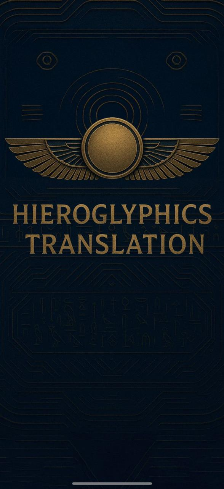
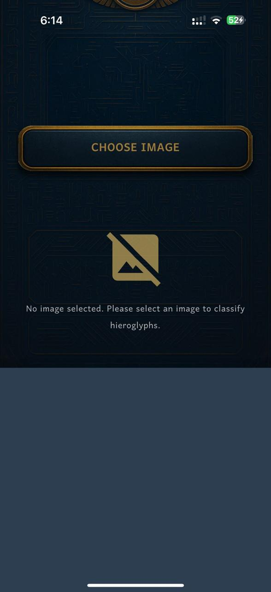
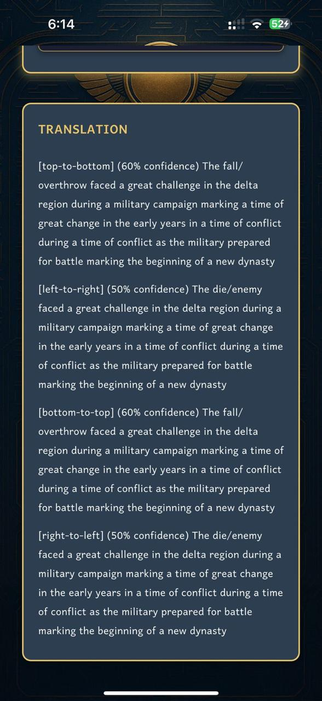

# 𓂀 Hieroglyphics Detection & End-to-End Translation Pipeline

An AI-powered pipeline designed to detect ancient Egyptian hieroglyphic symbols, classify them using Deep Learning, and translate the full text using LLMs.

## 🚀 Project Overview
This project provides an end-to-end solution for historical text digitization:
1. **Symbol Detection:** Extracting individual glyph contours using computer vision (OpenCV).
2. **Symbol Classification:** Recognizing over 100+ categories of hieroglyphs using a specialized Deep Learning architecture.
3. **Gardiner Sign Lookup:** Retrieving standardized linguistic definitions from the Gardiner list database.
4. **Contextual Translation:** Leveraging LLMs (Google Gemini AI) to handle reading directions and translate column-by-column into coherent modern text.

---

## 🧠 My Contribution: Deep Learning & Pipeline Integration
As the **Machine Learning Engineer** on this graduation project, I engineered and optimized the core classification model and integrated the full text translation pipeline:

### 1. Few-Shot Similarity Learning (Siamese Network)
* **The Challenge:** Hieroglyphic datasets suffer from severe class imbalance and limited training samples per glyph, making traditional Softmax classifiers perform poorly.
* **The Solution:** I built a **Siamese Network** to shift the problem from direct classification to **Metric Learning (Similarity Verification)**. 
* **Backbone:** Integrated a pretrained **SqueezeNet 1.1** as a lightweight feature extractor to generate dense 512-dimensional embeddings.
* **Loss & Optimization:** Trained with Binary Cross-Entropy (BCE) and Contrastive Learning principles to compute absolute distances between symbol representations.
* **Performance:** Reached an outstanding **~94% Validation Accuracy** on a dataset of 100+ highly complex symbol classes.

### 2. Reference Embeddings Database
* Engineered a script to generate and cache offline reference embeddings for the entire organized dataset (3270 symbols) using **Cosine Distance**. This allows the network to perform real-time, zero-shot classification on newly detected glyphs without retraining the model.

### 3. Pipeline Integration & LLM Orchestration
* Connected the OpenCV bounding boxes directly to the embedding network for sequential symbol routing.
* Prompt-engineered the **Gemini 1.5 Flash** API to digest column-by-column Gardiner definitions, resolve ancient Egyptian structural ambiguities, and deliver cohesive translations.

---

## 📊 Results & Outputs

### Training Performance & Metrics
Our Siamese Network converges efficiently within 10 epochs, leveraging Cosine Similarity for robust zero-shot inference:
* **Best Validation Accuracy:** ~94%
* **Reference Embeddings Cached:** 3270 symbols

### Final Translation Example
> **Input Query:** Sequential column data matched to Gardiner codes (e.g., M17, Y1, G43).
> 
> **Gemini Contextual Output:** > _"The inscription invokes Geb, the Earth god, to 'stretch out your arms' to his 'sons,' hinting at renewal and rebirth. It calls for a swift transition beyond 'long old age' into the eternal realm, sustained by rituals, 'recitations,' 'tribute,' and the essential 'beer,' ensuring divine placement. Ultimately, the text articulates a hopeful journey towards an enduring, divinely-secured afterlife for the honored individual, guided and blessed by the pantheon.
."_

---

## 📱 Mobile Application Core
The complete lifecycle of this project includes a cross-platform application interface leveraging this exact Machine Learning backend for real-time mobile scanning and translation:

<p align="center">
   &nbsp;&nbsp;&nbsp;&nbsp;
   &nbsp;&nbsp;&nbsp;&nbsp;
  
</p>

---

## 🛠️ Tech Stack & Frameworks
* **Deep Learning:** PyTorch, Torchvision
* **Computer Vision:** OpenCV (Contour analysis, OTSU Thresholding)
* **LLM Integration:** Google GenAI SDK (Gemini-1.5-Flash)
* **Data Infrastructure:** SciPy (Cosine Metrics), NumPy, Pickle, PIL

---

## 💻 How to Run

1. **Clone the Repository:**
   ```bash
   git clone [https://github.com/Lenda-mahmoud/Hieroglyphics-Detection-Translation-HeiroVision.git](https://github.com/Lenda-mahmoud/Hieroglyphics-Detection-Translation-HeiroVision.git)
   cd Hieroglyphics-Detection-Translation-HeiroVision
2.**Install Dependencies:**
pip install -r requirements.txt

3.**Explore the Notebooks:**

    >Run src/Hieroglyphics_Siamese_Model.ipynb to check the Siamese Network training setup and SqueezeNet backbone configuration.
    >Run src/Hieroglyphics_Translation.ipynb to execute the full end-to-end pipeline (OpenCV detection -> Siamese classification -> Gemini translation).
#📌 Project Notes & System Integration

    > System Focus: This repository acts as the primary sandbox and testing environment for the core Machine Learning architecture, model evaluation, and backend pipeline routing.

   > Team UI Component: While the complete production-level implementation featured a distributed codebase and a mobile interface developed by the team, this specific workspace showcases the core AI algorithm development, verification logic, and LLM orchestration logic.
